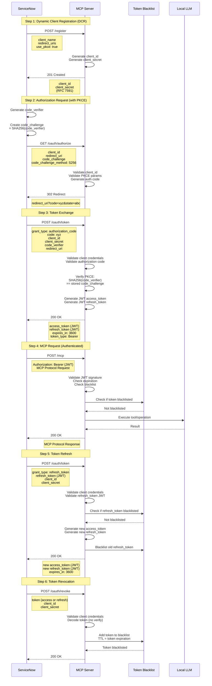

# OAuth 2.1 + PKCE Flow Diagram

This diagram illustrates the complete OAuth 2.1 authorization flow with PKCE (Proof Key for Code Exchange) as implemented in the MCP Server.

## Flow Overview

The diagram shows six key steps:

1. **Dynamic Client Registration (DCR)**: ServiceNow registers as an OAuth client
2. **Authorization Request**: ServiceNow initiates authorization with PKCE challenge
3. **Token Exchange**: ServiceNow exchanges authorization code with code_verifier for tokens
4. **MCP Request**: ServiceNow makes authenticated requests to MCP server
5. **Token Refresh**: ServiceNow refreshes expired access tokens
6. **Token Revocation**: ServiceNow revokes tokens when no longer needed

## Standards Implemented

- **OAuth 2.1**: Latest OAuth best practices (consolidation of OAuth 2.0 security improvements)
- **RFC 7636**: PKCE (Proof Key for Code Exchange)
- **RFC 7519**: JSON Web Tokens (JWT)
- **RFC 7591**: Dynamic Client Registration
- **RFC 7009**: Token Revocation

## Interactive Diagram



## Key Security Features

### PKCE (Proof Key for Code Exchange)
- **code_verifier**: Random string generated by client (43-128 characters)
- **code_challenge**: SHA256 hash of code_verifier, sent in authorization request
- **Verification**: Server verifies SHA256(code_verifier) matches stored code_challenge
- **Protection**: Prevents authorization code interception attacks

### JWT Tokens
- **Stateless**: No server-side session storage required
- **Self-contained**: All claims embedded in token
- **Signed**: HMAC-SHA256 signature prevents tampering
- **Expiring**: Short-lived access tokens (1 hour), longer refresh tokens (30 days)

### Token Blacklist
- **Revocation**: Blacklisted tokens cannot be reused
- **Refresh Rotation**: Old refresh tokens blacklisted on rotation
- **TTL-based**: Tokens automatically removed from blacklist after expiration
- **Redis**: Fast in-memory lookup with persistence

## Token Lifetimes

| Token Type | Lifetime | Rotation | Storage |
|------------|----------|----------|---------|
| Authorization Code | 5 minutes | Single-use | Server memory |
| Access Token | 1 hour | Via refresh | Client storage |
| Refresh Token | 30 days | Yes (on use) | Client storage + blacklist |

## Authentication Flow Notes

### Machine-to-Machine Authentication
This implementation uses **machine-to-machine** OAuth 2.1:
- ServiceNow is a trusted client
- ServiceNow handles user authentication
- MCP Server handles client authentication
- No additional user consent required

### ServiceNow as Client
ServiceNow AI Platform acts as the OAuth client:
- Stores client credentials securely
- Manages token lifecycle
- Includes tokens in MCP requests
- Handles token refresh automatically

### Security Boundaries
- **User Authentication**: Handled by ServiceNow (user login)
- **Client Authentication**: Handled by MCP Server (client credentials)
- **Request Authorization**: Handled by both (JWT validation)

## Implementation Details

### DCR (Dynamic Client Registration)
```
POST /register
Authorization: Bearer {DCR_TOKEN} (optional)

Response: 201 Created
{
  "client_id": "oauth21_abc123",
  "client_secret": "secret_xyz789",
  "redirect_uris": ["https://instance.service-now.com/oauth_redirect"],
  "grant_types": ["authorization_code", "refresh_token"]
}
```

### Authorization Endpoint
```
GET /oauth/authorize?
  client_id=oauth21_abc123&
  redirect_uri=https://instance.service-now.com/oauth_redirect&
  response_type=code&
  code_challenge=E9Melhoa2OwvFrEMTJguCHaoeK1t8URWbuGJSstw-cM&
  code_challenge_method=S256&
  state=random_state

Response: 302 Redirect
Location: https://instance.service-now.com/oauth_redirect?code=auth_xyz&state=random_state
```

### Token Endpoint (Authorization Code)
```
POST /oauth/token
Content-Type: application/x-www-form-urlencoded

grant_type=authorization_code&
code=auth_xyz&
client_id=oauth21_abc123&
client_secret=secret_xyz789&
code_verifier=dBjftJeZ4CVP-mB92K27uhbUJU1p1r_wW1gFWFOEjXk&
redirect_uri=https://instance.service-now.com/oauth_redirect

Response: 200 OK
{
  "access_token": "eyJhbGc...",
  "token_type": "Bearer",
  "expires_in": 3600,
  "refresh_token": "eyJhbGc..."
}
```

### Token Endpoint (Refresh Token)
```
POST /oauth/token
Content-Type: application/x-www-form-urlencoded

grant_type=refresh_token&
refresh_token=eyJhbGc...&
client_id=oauth21_abc123&
client_secret=secret_xyz789

Response: 200 OK
{
  "access_token": "eyJhbGc...",
  "token_type": "Bearer",
  "expires_in": 3600,
  "refresh_token": "eyJhbGc..."
}
```

### MCP Endpoint (Authenticated)
```
POST /mcp
Authorization: Bearer eyJhbGc...
Content-Type: application/json

{
  "jsonrpc": "2.0",
  "method": "tools/call",
  "params": {
    "name": "llm_generate",
    "arguments": { "prompt": "Hello" }
  },
  "id": 1
}

Response: 200 OK
{
  "jsonrpc": "2.0",
  "result": {
    "content": [
      { "type": "text", "text": "Generated response" }
    ]
  },
  "id": 1
}
```

### Revocation Endpoint
```
POST /oauth/revoke
Content-Type: application/x-www-form-urlencoded

token=eyJhbGc...&
client_id=oauth21_abc123&
client_secret=secret_xyz789

Response: 200 OK
```

## Related Documentation

- **[Part 4: OAuth Implementation](../MCP%20Server%20Implementation%20-%20Part%204%20OAuth.md)**: Complete OAuth 2.1 implementation guide
- **[Pseudocode Template](../../templates/mcp-server-pseudocode-template.md)**: Language-agnostic OAuth implementation
- **[Implementation Hints](../MCP%20Server%20Implementation%20-%20Implementation%20Hints.md)**: Language-specific OAuth patterns

## External References

- [RFC 9068 - JWT Access Tokens](https://datatracker.ietf.org/doc/html/rfc9068)
- [RFC 7636 - PKCE](https://datatracker.ietf.org/doc/html/rfc7636)
- [RFC 7591 - Dynamic Client Registration](https://datatracker.ietf.org/doc/html/rfc7591)
- [RFC 7009 - Token Revocation](https://datatracker.ietf.org/doc/html/rfc7009)
- [OAuth 2.1 Draft](https://datatracker.ietf.org/doc/html/draft-ietf-oauth-v2-1)

---

**Note**: This diagram and documentation reflect the actual implementation in the MCP Server templates. All code examples are production-ready patterns used in the reference implementations.
